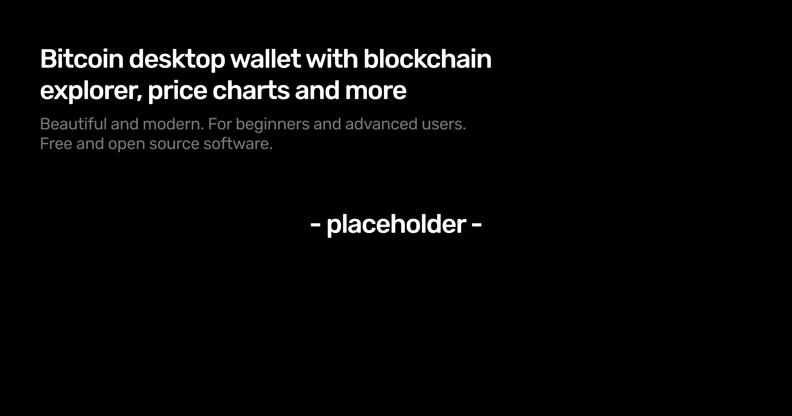

# MyBitG

Beautiful and modern bitcoin desktop wallet with blockchain explorer and price charts. For beginners and advanced users. Free. Open source.

## Documentation

Visit _todo_ to view the documentation.

## Report Issues

Please use the [Issues](https://github.com/MyBitG/mybitg/issues) tab above to report an issue.

## Contributing

Please read the [contributing guide](/CONTRIBUTING.md).

## License

Licensed under the [MIT license](/LICENSE.md).

## GPG Key

_todo_
